# What gives the best flow matching models? Ablations on pose generation

**Question:** what do I need to do to get the best samples from the flow matching transformer?

**Scope:** SE(3) pose generation, in two settings:
- [Part 1](#part-1-discrete-conditioning), **discrete conditioning:** each sample is conditioned on action
  tokens that name a goal region.
- [Part 2](#part-2-continuous-conditioning), **continuous conditioning:** every sample's condition is
  different (noisy tokens, or a goal position anywhere on a disk). The question there is how to pair noise
  with data for minibatch OT.
- [Part 3](#part-3-the-current-model-and-training-framework), **the current framework:** Parts 1 and 2 used the
  original model and training recipe. Part 3 moves both to current flow-matching practice, repeats the OT,
  guidance and pairing comparisons on the 3σ task under both kinds of conditioning, and ablates the design
  choices the field hasn't settled.

MNIST (image generation, class conditioning) hasn't been run yet, so none of this is verified for images.

## Recommendation

### Discrete conditions

**Best configuration on this data:** a conditional model trained with **per-condition minibatch OT**, sampled
at **guidance 1** with **5–9 Euler steps**.

- **Pair noise to data with minibatch OT, within each condition.** At 3 Euler steps it gives 4–8× lower energy
  distance; at 100 steps it's level. It costs ~40% more training time. [Details](#1-ot-fast-sampling-for-40-more-training-time).
- **Don't guide: sample at guidance 1.** Every guidance above 1 makes samples less like the data, and guidance
  costs a second forward pass per step. [Details](#2-guidance-condition-separation-at-the-cost-of-fidelity).
- **CFG training is optional.** Null-token dropout doesn't hurt: at guidance 1, a CFG-trained model matches one
  trained without it. So it only keeps the option of guidance open.
- **With OT, 5–9 Euler steps are enough** (3 if speed matters most). Without OT, the model needs ~20.
- **Train for at least 100 epochs, and probably longer.** Energy distance flattens by epoch 30–50, but on the
  two-orientations task the excess spread is still shrinking at epoch 100. [Details](#3-training).

**What no setting fixes yet:** every conditional model spreads its samples **about 1.15–1.5× wider than the
data**. That's the main visible reason the best energy distance is still 10–40× the real-data floor. See
[Open problem](#open-problem-over-dispersion).

### Continuous conditions

**Best configuration on this data:** a **condition-aware pairing, with its knob calibrated and the OT batch equal
to the network batch.** It beats random pairing at 1–5 Euler steps and matches it from 9 on. This was measured for
the fixed weight on continuous goals; the main comparison used a 4× OT batch.

- **Per-condition OT doesn't carry over.** When every condition is different, it is random pairing.
  [Details](#the-problem)
- **Never pair over the whole batch while ignoring conditions.** Global OT was the worst pairing at every step
  count, 8–120× worse than random pairing.
- **Calibrate before training.** At the papers' defaults, the condition-aware pairings barely changed the pairing
  on these tasks, because one large offset shared by every pair dominates the cost. `./pose_ablations.sh calibrate`
  sets each knob without training: the loosest setting whose prior skew stays ≤ 0.02.
  [Details](#2-calibrate-first-the-published-defaults-barely-pair-on-poses)
- **Choose the OT batch by your sampling budget.** A 4× OT batch roughly halves the one-step error of a 1× batch,
  but leaves the 100-step error 1.5–2.3× above random pairing. [Details](#5-what-sets-the-trade-off-the-ot-batch)
- **The three methods are close once calibrated.** The fixed weight was best and most consistent on continuous
  goals; cluster was best on noisy tokens, where the conditions form groups. C²OT was never best here, and its
  per-batch weight search made it the slowest of the three to train. All three passed a toy check against
  C²OT's published results. [Details](#4-results)

## Part 1: Discrete conditioning

### The evidence at a glance

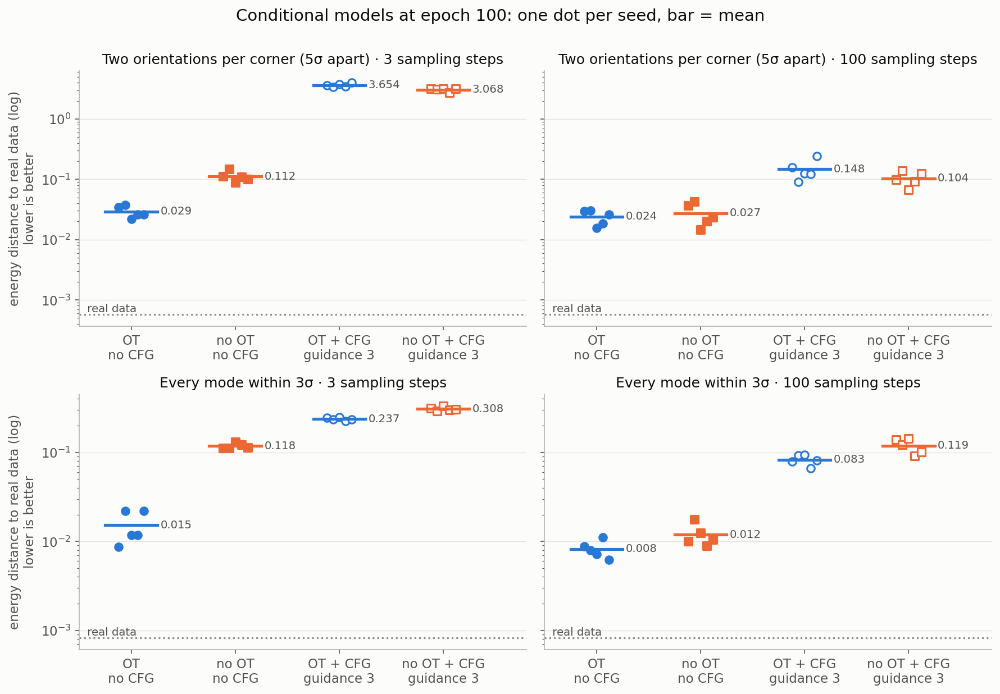

*Energy distance to real data (log scale, lower is better) for the four conditional configurations, at 3 and 100
sampling steps. One dot per seed; the bar is the mean. CFG-trained models are sampled at the default guidance of 3.
Epoch 100.*

- **OT, no CFG wins in every panel.** It matters most at 3 steps: 0.029 vs. 0.112 without OT (two orientations)
  and 0.015 vs. 0.118 (within 3σ).
- **At 100 steps, OT and no OT are level** (0.024 vs. 0.027; 0.008 vs. 0.012).
- **Guidance 3 is the worst choice everywhere:** 4–10× worse than unguided at 100 steps, and catastrophic at 3
  steps on the first task (3.1–3.7).

### Tasks and setup

Two pose tasks, both with **bimodal conditions**: the tokens name a corner, and each corner holds two goal
orientations. A good model must keep both orientations rather than averaging them.

- **Two orientations per corner** (`configs/pose_tasks/corners_two_orientations.yaml`): four corners 10 units apart,
  each with two orientations rotated ±0.25 rad about z (5σ apart). Picking the corner is easy; keeping both
  orientations isn't.
- **Every mode within 3σ** (`configs/pose_tasks/corners_3sigma.yaml`): the same 8 modes packed so every pair is
  within 3σ (σ = 0.1) in position and orientation. The corners overlap, so even real data can't be sorted
  perfectly: only **73.4%** of real samples are nearest to a mode of their own corner.

The original four-corners task is left out: its modes are far apart and every model solves it. Its results, and
the history of this study (including a conditional-OT pairing bug that was found and fixed), are in the previous
version of this file at tag `pose-two-orientations-v1`.

**Variants:** 2 × 2 conditional models (OT or not × CFG or not), plus unconditional models with and without OT.
Each has 5 seeds and trains for 100 epochs with identical hyperparameters:
- batch 128;
- AdamW at a constant LR of 1e-4;
- for CFG models, 10% null-token dropout per sample plus 10% per token.

Samples use Euler integration from a unit Gaussian in twist space. The evaluation uses 256 samples per model
(64 per condition), with the same start noise for every model.

**Metrics:**
- **Energy distance** (primary): distance between the sample distribution and real data, per goal mode. Real
  data scores about 0.001. It catches collapse, excess spread and bias alike.
- **Corner accuracy:** the share of samples nearest to a mode of the requested corner. On the 3σ task it has a
  ceiling of 0.734, and **higher is not better**: a sampler above it separates the corners more than the data
  does.
- **Orientation split:** how each condition's samples divide between its two orientations (real data: 50/50 ±
  sampling noise).
- **Spread ratio:** the samples' spread around their mode, relative to real data's.

### 1. OT: fast sampling for ~40% more training time

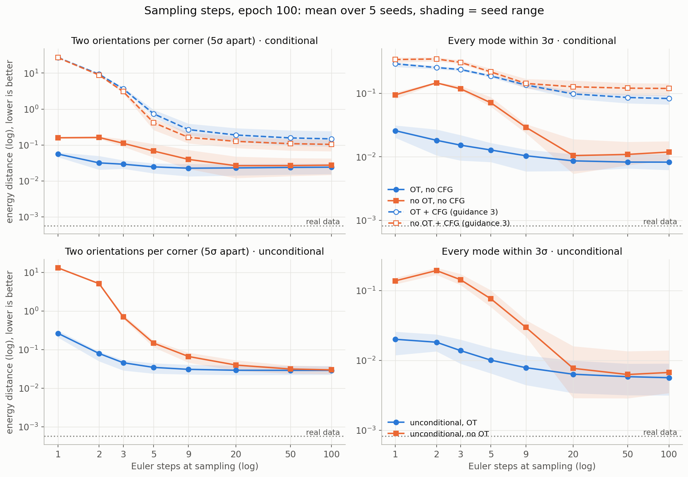

*Energy distance vs. number of Euler steps (both axes log). Mean over 5 seeds; shading = seed range. Top:
conditional models (dashed = CFG-trained, sampled at guidance 3). Bottom: unconditional models.*

- **With OT, the model converges in few steps.** On the two-orientations task, 3 steps get within 1.2× of its
  100-step quality and 9 steps match it. On the 3σ task, 3 steps are within 2× and 9 steps within 1.3×.
- **Without OT it needs about 20 steps** before it catches up.
- **Unconditional models show the same pattern:** at 3 steps, energy distance is 0.046 vs. 0.69 and 0.014 vs.
  0.14.
- **The guided models' few-step failure is caused by guidance, not by OT:** both OT and no-OT CFG models are bad.

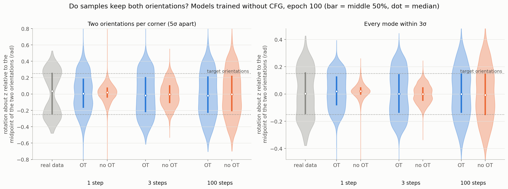

*Each sample's rotation about z relative to the midpoint between its corner's two orientations (dotted lines =
the two targets). Models trained without CFG; 128 samples per condition × 4 conditions × 5 seeds per violin.*

**Why OT matters here:**
- Without OT, the model learns the *average* velocity toward the two orientations, so few-step samples land
  *between* them. At 1–3 steps, the no-OT violins are single narrow lumps at 0, while real data is bimodal.
- OT pairs each noise sample with a specific orientation during training: noise with positive rotation about z goes
  to the positive orientation. The learned flow therefore splits early, and even 1-step samples keep both
  orientations.
- At 100 steps the two are the same; both are wider than the data (see
  [Open problem](#open-problem-over-dispersion)).

**Costs:**
- **Training time:** OT computes a Hungarian assignment within each condition for every minibatch. Conditional
  runs took ~700 s with OT vs. ~500 s without (6 runs in parallel on one RTX 4090).
- **Sampling:** no cost. OT changes only training.
- **Implementation:** pair within each condition. Pairing across the whole mixed-condition batch biases each
  condition's noise toward its own goal, and it hurt conditional models in an earlier round.

### 2. Guidance: condition separation at the cost of fidelity

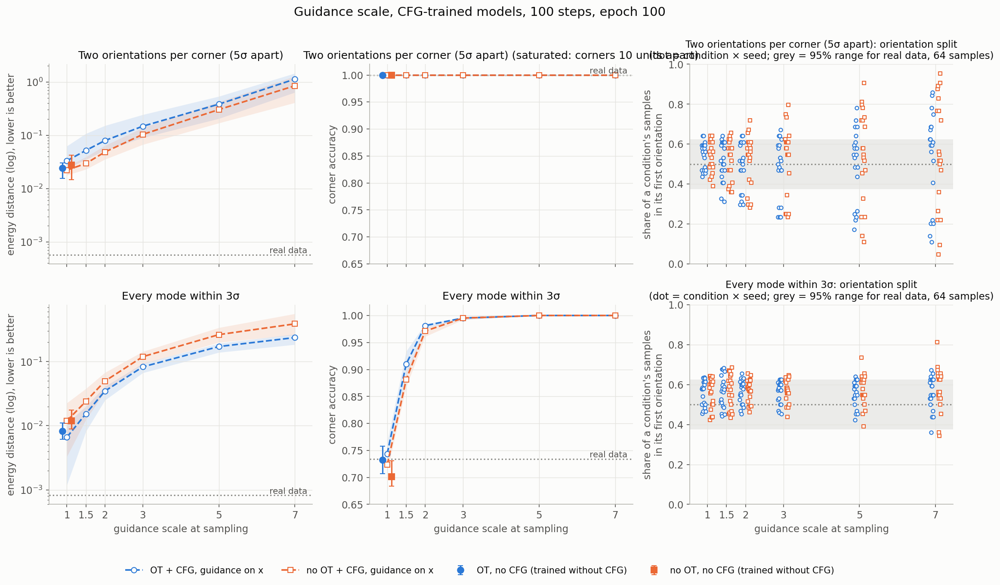

*CFG-trained models sampled at guidance 1–7, 100 steps. Lines = mean over seeds (shading = range). The separate
markers at guidance 1 are the models trained without CFG. Right: each condition's split between its two
orientations, one dot per condition × seed; grey band = the 95% range for a perfect sampler with 64 samples.*

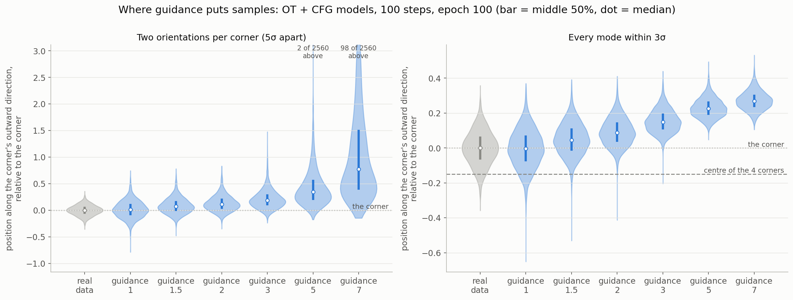

*Each sample's position along its corner's outward direction (away from the other corners), relative to the
corner. OT + CFG models, 128 samples per condition × 4 conditions × 5 seeds per violin.*

Guidance extrapolates away from the unconditional prediction. Here that means pushing each sample away from the
other conditions:

- **Samples move outward, past their corner.**
  - On the 3σ task, the median sample sits 0.15 beyond its corner at guidance 3, as far again as the corner is
    from the cluster centre, and 0.27 beyond at guidance 7.
  - On the two-orientations task, the median sits 0.18 beyond at guidance 3 and 0.77 beyond at guidance 7, where
    4% of samples land more than 3 units out.
- **Corner accuracy rises above what real data achieves:** 0.74 → 0.91 → 0.98 → 0.995 at guidance 1 / 1.5 / 2 / 3
  on the 3σ task, against 0.734 for the data. The samples become *easier to classify than real data*. That is a
  distortion, not an improvement.
- **The orientation split gets lopsided, where orientations differ between conditions.**
  - On the two-orientations task, each corner's orientations are its own, and at guidance 3 several conditions
    split 25/75.
  - On the 3σ task every corner shares the same two orientations, so there's nothing in rotation for guidance to
    amplify, and the split stays balanced.
- **Energy distance gets steadily worse with guidance on both tasks.** At guidance 1, a CFG-trained model matches
  one trained without CFG: 0.022–0.033 vs. 0.024–0.027, and 0.007–0.012 vs. 0.008–0.012.

**When guidance could still be worth it:** when you want samples that are unambiguous about their condition
more than samples that match the data. Even then, 1.5 is the most to try. Guidance also doubles the per-step
compute, because it needs a second, unconditional pass.

### 3. Training

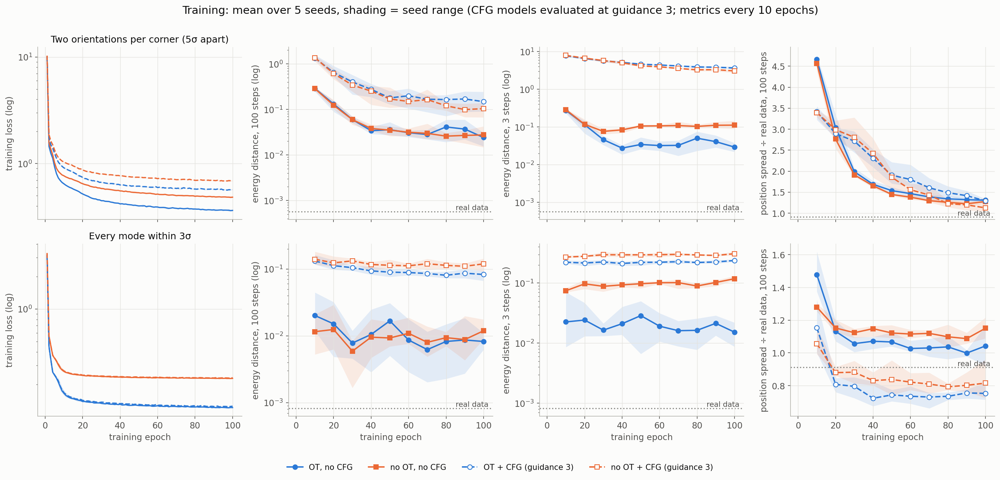

*Left: training loss per epoch. Then energy distance at 100 and 3 sampling steps, and position spread relative
to real data, evaluated every 10 epochs. Mean over 5 seeds; shading = seed range. CFG-trained models are sampled
at guidance 3.*

- **Energy distance converges early.**
  - On the 3σ task it is flat from about epoch 30, and the epoch-to-epoch wobble is seed noise.
  - On the two-orientations task it falls until about epoch 40–50, then improves only slowly.
- **The few-step advantage of OT appears early:** by epoch 10 on the 3σ task and by epoch 30–40 on the
  two-orientations task. It holds through epoch 100.
- **Over-dispersion is still shrinking at epoch 100 on the two-orientations task:** position spread falls from
  4.6× at epoch 10 to 1.3× at epoch 100 and hasn't levelled off. On the 3σ task it settles at 1.0–1.15× by
  epoch 20.
- **OT's training loss is lower,** but that doesn't mean its model is better. OT pairing makes the regression
  target less noisy, so the losses of OT and no-OT runs aren't comparable. Only the shape of each curve is
  informative.
- **Guidance 3 shrinks the spread below the data's** on the 3σ task (0.75–0.82×), the other side of its outward
  push.

Practical reading: 100 epochs is enough for energy distance on both tasks. The remaining spread error on the
two-orientations task looks like a training-length problem, so longer training is the cheapest next
experiment.

### 4. What the samples look like

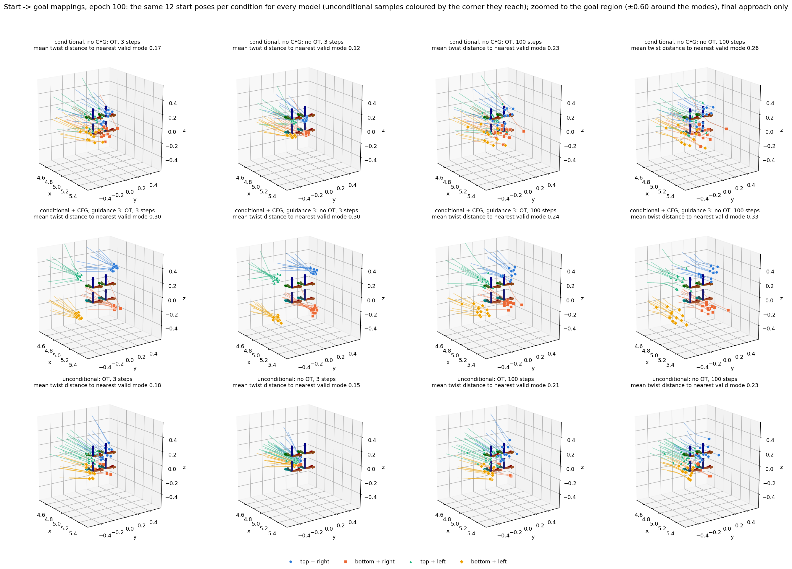

*3σ task, seed 1, epoch 100: start → goal paths near the goal region for each model, at 3 and 100 steps.
Every model gets the same start poses. At guidance 3 (middle row), each corner's samples sit outside the corner,
away from the other three. Without OT at 3 steps (top row, second panel), samples bunch tightly on the corners
instead of spreading like the data.*

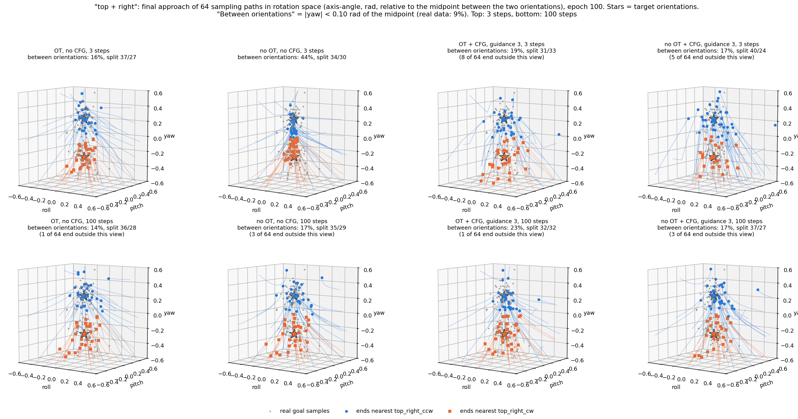

*Two-orientations task, seed 1, epoch 100: the final approach of one condition's sampling paths in rotation space,
relative to the midpoint between its two orientations (stars). Without OT at 3 steps, 44% of the endpoints end
between the stars, vs. 16% with OT and 9% of real samples. At 100 steps it's 14–23% for every model.*

### Open problem: over-dispersion

Every conditional model spreads its samples too widely at 100 steps:
- **Two orientations:** 1.28–1.31× in position and 1.33–1.45× in rotation, against the data's 0.91 / 0.96.
- **Within 3σ:** 1.04–1.15× / 1.06–1.17×, against 0.91 / 0.92.

This is the main visible reason the best energy distance is 10–40× the real-data floor, and none of the ablated
components fixes it. Candidates to try next, cheapest first:

- **Longer training.** On the two-orientations task, the spread is still shrinking at epoch 100 (see
  [Training](#3-training)).
- **Learning-rate decay or EMA weights.** The pose trainer uses a constant LR of 1e-4 with no EMA, so the final
  weights carry optimisation noise. Both are standard in flow matching.
- **Continuous training times.** Training only sees 10 fixed time values (multiples of 1/9), so the velocity
  field between them is interpolated.

**Update:** the current framework fixes this on the 3σ task (0.93–0.95× at 100 steps, data 0.91). EMA weights
and continuous training times are both part of it. See [Part 3](#1-the-current-framework-beats-the-old-one-at-every-step-count).

## Part 2: Continuous conditioning

**Question:** when no two training samples share a condition, how should noise be paired with data?

### The problem

Part 1 pairs noise with data separately within each condition. When every condition is slightly different (a
goal position, a noisy token, an observation), each condition holds a single sample, so that pairing is just
random pairing (I-CFM) and the few-step benefit of OT is gone. Pairing over the whole batch while ignoring
conditions is no answer either. It gives each condition only the noise nearest its own goals, the skew that hurt
conditional models in Part 1's history; here it fails outright.

Condition-aware pairings let noise move only between *nearby* conditions. The methods and their references are
in [readme section 6](readme.md#6-ot-pairing-with-continuous-conditions-1015).

### Pairings compared

| Pairing | Cost of pairing noise i with data j | Knob | Source |
|---|---|---|---|
| random (I-CFM) | none | none | baseline; what per-condition OT becomes here |
| global OT | cost(x0ᵢ, x1ⱼ) | none | baseline; ignores conditions |
| per-corner OT (oracle) | the cost, within each corner only | none | noisy-token task only: uses the true corner ids, which a real continuous task doesn't have |
| C²OT | cost + w·‖cᵢ − cⱼ‖², with w set per batch so a share `r_tar` of all pairs is admissible | `r_tar` | Cheng & Schwing, ICCV 2025 |
| fixed weight | cost + w·‖cᵢ − cⱼ‖², with w fixed at `cond_scale` × mean cost ÷ mean ‖cᵢ − cⱼ‖² | `cond_scale` | COT-FM (Kerrigan et al., NeurIPS 2024); Bayesian OT FM (Chemseddine et al., JMLR 2025) |
| cluster | cost + γ·‖c̄ᵢ − c̄ⱼ‖² on K-means centroids (K = the OT batch); γ set like the fixed weight, per batch | `cond_scale` | COT Policy (Sochopoulos et al., CoRL 2025) |

cᵢ is the condition of the data sample that noise i was drawn with. The network always sees each data sample's
own condition. Every OT-based pairing solves one assignment over an OT batch of 4 network batches (512 samples)
and splits it into 4 training steps.

### 1. Toy check: the implementation reproduces C²OT

Before the pose runs, every pairing was trained on two 2-D toys with C²OT's toy hyperparameters (3 seeds each).

| Pairing | Moons W₂², 1 Euler step | Moons W₂², adaptive RK45 | Fork W₂², 1 step | Fork: samples on a branch, 1 step |
|---|---|---|---|---|
| random (I-CFM) | 0.71 ± 0.05 (paper 0.73) | 0.062 (paper 0.028) | 0.146 | 47% |
| global OT | 1.66 ± 0.07 (paper 8.3 ± 6.5) | 1.72 (paper 2.1) | 0.025 | 74% |
| C²OT | **0.071** ± 0.015 (paper 0.077) | **0.027** (paper 0.013) | 0.0049 | 92% |
| fixed weight | 0.078 ± 0.023 | 0.043 | 0.0038 | 95% |
| cluster | 0.081 ± 0.029 | 0.041 | **0.0033** | **96%** |

Real data scores 0.018 (moons) and 0.0006 (fork) against an independent draw: the floor of the 4096-sample W₂².
The condition-aware pairings kept the fork's two branches at 50/50 (50–51%).

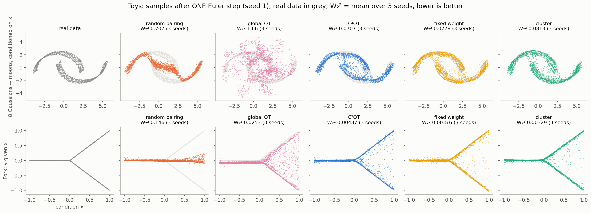

*One-step samples of each pairing (seed 1), real data in grey. Random pairing averages the fork's branches into
one line and pulls the moons inward; global OT scatters samples off the data; the condition-aware pairings keep both.*

- **The ordering matches the paper:** global OT ≫ random > C²OT at one step, and C²OT's one-step W₂² (0.071)
  matches the published 0.077. The absolute adaptive-solver numbers sit higher than the paper's because of the
  sample-size floor (0.018).
- **On the toys, all three condition-aware pairings work at the papers' default settings.**

### 2. Calibrate first: the published defaults barely pair on poses

`pairing_diagnostics.py` measures what a pairing does to training batches, without training:

- **Branch agreement:** the share of noise sent to the orientation it points at (the sign of its rotation
  about z). Random pairing scores 0.5; this is what lets few-step samples keep both orientations.
- **Prior skew:** held-out R² of a quadratic regression predicting a sample's condition from its paired noise.
  0 means every condition still trains on the whole noise distribution, as sampling assumes.

At the papers' defaults (C²OT `r_tar` 0.01; fixed weight and cluster `cond_scale` 10), on OT batches of 512:

| Pairing | Noisy tokens: agreement / skew | Continuous goals: agreement / skew |
|---|---|---|
| random (I-CFM) | 0.50 / 0.00 | 0.50 / 0.00 |
| per-corner OT (oracle) | 0.79 / 0.00 | n/a |
| global OT | 0.76 / **0.10** | 0.82 / **0.90** |
| C²OT, default | **0.51** / 0.00 | 0.64 / 0.00 |
| fixed weight, default | **0.50** / 0.00 | **0.55** / 0.00 |
| cluster, default | **0.56** / 0.00 | **0.58** / 0.00 |

At their defaults the condition-aware pairings are close to random pairing. **Why:** the pairing cost is
dominated by the 5-unit translation from the noise to the goals, which every pair shares. The fixed and cluster
weights scale with the *mean* cost, so the condition penalty swamps the small differences between candidate
partners. C²OT's rule tracks those differences, but at `r_tar` 0.01 it admits too few pairs. On the toys there's
no such offset, which is why the defaults work there.

**Calibration:** each knob is loosened from the default until the prior skew would exceed 0.02, and the loosest
setting within that bound is used (`./pose_ablations.sh calibrate`).

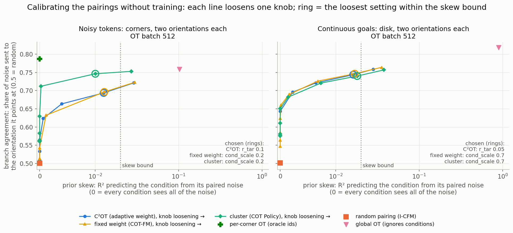

*Branch agreement against prior skew as each knob loosens (no training). Rings: the chosen settings.*

| Calibrated setting | Noisy tokens | Continuous goals |
|---|---|---|
| C²OT | `r_tar` 0.1: agreement 0.69, skew 0.013 | `r_tar` 0.05: 0.74, 0.016 |
| fixed weight | `cond_scale` 0.2: 0.70, 0.013 | `cond_scale` 0.7: 0.75, 0.017 |
| cluster | `cond_scale` 0.2: **0.75**, 0.010 | `cond_scale` 0.7: 0.74, 0.018 |

- **On continuous goals the three trace the same agreement-vs-skew curve.**
- **On noisy tokens cluster's curve sits higher,** most likely because the K-means centroids recover the corner
  structure. It gets closest to the oracle (0.79) for the same skew.

### 3. Tasks and setup

- **Noisy tokens** (`configs/pose_tasks/corners_two_orientations_jitter.yaml`): Part 1's two-orientations task
  with Gaussian noise (std 0.1) on every token dimension, so no two samples share a condition. Two corners' token
  pairs stay at least 2 apart (two noisy copies of one corner, about 0.5), so the conditions still cluster by
  corner. Evaluation draws fresh token noise from its own seed, 64 samples per corner.
- **Continuous goals** (`configs/pose_tasks/continuous_goals.yaml`): the condition c is a point anywhere on a
  disk of radius 5 in the y-z plane. The goal sits at (5, c) and holds two orientations ±0.25 rad (5σ) about z,
  around a base yaw that turns with c (90° + 0.5 rad · c_y/5). The model sees c/5. Evaluation uses 16 fixed test
  conditions × 64 samples; each condition's samples are scored against that condition's own modes and real
  samples, then averaged.
- **Training:** 5 seeds × 100 epochs, batch 128, conditional models without CFG, otherwise Part 1's
  hyperparameters. Every pairing uses the calibrated knobs above.
- **Metric:** energy distance to real data, per mode (as in Part 1); the orientation split as an imbalance KL.

### 4. Results

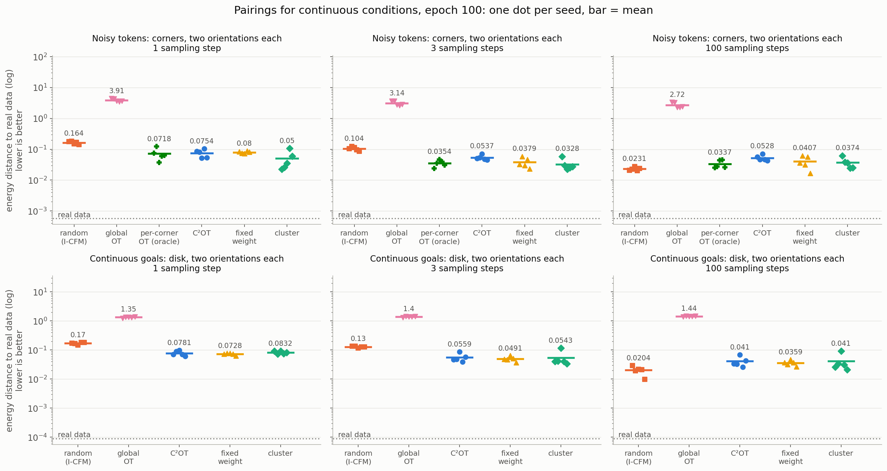

*Energy distance to real data (log, lower is better) at 1, 3 and 100 Euler steps. One dot per seed; bar = mean.
Epoch 100.*

| Energy distance | random (I-CFM) | global OT | oracle | C²OT | fixed weight | cluster |
|---|---|---|---|---|---|---|
| Noisy tokens, 1 step | 0.164 | 3.9 | 0.072 | 0.075 | 0.080 | **0.050** |
| Noisy tokens, 3 steps | 0.104 | 3.1 | 0.035 | 0.054 | 0.038 | **0.033** |
| Noisy tokens, 100 steps | **0.023** ± 0.003 | 2.7 | 0.034 ± 0.010 | 0.053 ± 0.012 | 0.041 ± 0.019 | 0.037 ± 0.015 |
| Continuous goals, 1 step | 0.170 | 1.35 | n/a | 0.078 | **0.073** | 0.083 |
| Continuous goals, 3 steps | 0.130 | 1.40 | n/a | 0.056 | **0.049** | 0.054 |
| Continuous goals, 100 steps | **0.020** ± 0.007 | 1.44 | n/a | 0.041 ± 0.017 | 0.036 ± 0.008 | 0.041 ± 0.030 |

- **Condition-aware pairing cuts few-step error 2–3×.** At 1–3 steps every calibrated pairing beats random
  pairing on both tasks, and cluster matches or beats the oracle on noisy tokens.
- **It keeps both orientations at one step.** The orientation imbalance KL at 1 step is 0.012–0.037 for the
  condition-aware pairings against 0.12–0.15 for random pairing, whose one-step samples land between the two
  orientations (below).
- **Global OT fails at every step count:** 8–24× worse than random pairing at one step and 70–120× at 100
  steps, with samples spread 8–24× wider than the data. The skewed prior does far more damage here than in Part 1's
  history, where the pre-fix model landed about 3× further from its target modes.
- **Random pairing catches up at about 9 steps and wins beyond.** At 100 steps it's 1.5–2.3× better than
  every OT pairing here, including the per-corner oracle, and its seeds are tighter. For the fixed
  weight on continuous goals, the [sensitivity sweep](#5-what-sets-the-trade-off-the-ot-batch) traces this to
  the 4× OT batch these runs used.

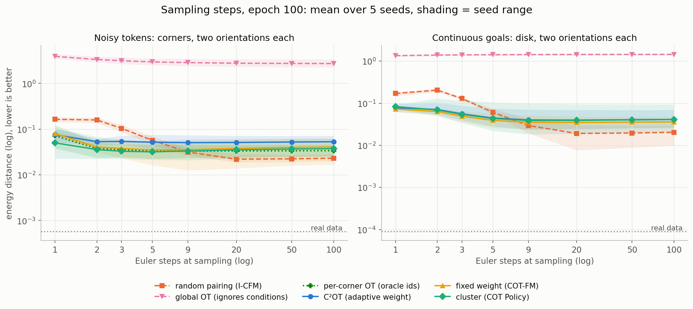

*Energy distance vs. Euler steps (both axes log). Mean over 5 seeds; shading = seed range.*

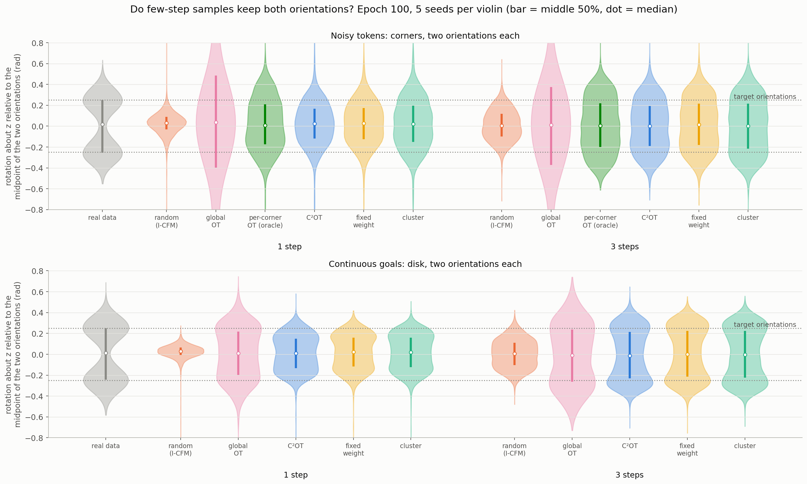

*Each sample's rotation about z relative to the midpoint of its condition's two orientations, at 1 and 3 steps
(dotted lines = the two targets). 5 seeds per violin.*

**Costs:** training took 1.2–1.6× as long as random pairing (one Hungarian solve per 4 steps, plus the weight
search for C²OT; 6 runs shared one GPU). Sampling cost is unchanged.

### 5. What sets the trade-off: the OT batch

The fixed weight (best on continuous goals) was retrained with one setting varied at a time, 3 seeds each
(`SENS_PAIRING=c2ot_fixed ./pose_ablations.sh sensitivity`).

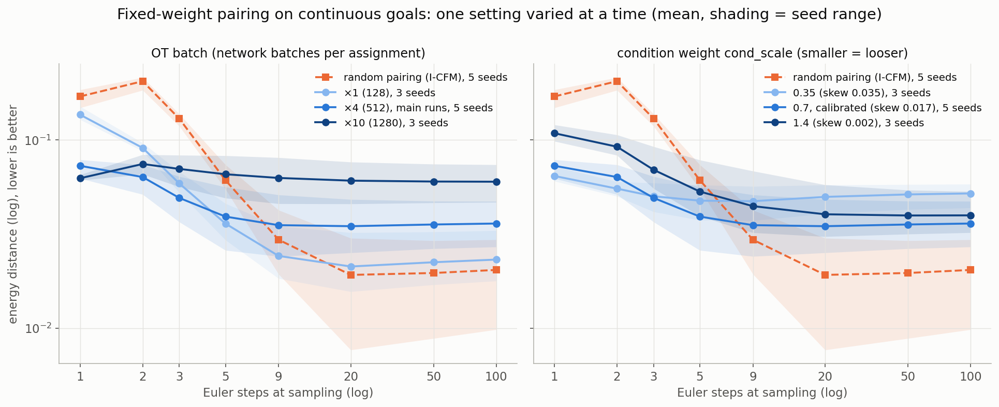

*Energy distance vs. Euler steps for each setting, against random pairing (orange). Left: the OT batch; right: the
condition weight. Mean over seeds; shading = seed range.*

| Fixed weight, continuous goals | 1 step | 2 steps | 3 steps | 9 steps | 100 steps |
|---|---|---|---|---|---|
| random pairing (I-CFM) | 0.170 | 0.205 | 0.130 | 0.030 | 0.020 |
| OT batch ×1 (128) | 0.136 | 0.091 | 0.059 | **0.024** | **0.023** |
| OT batch ×4 (512), main runs | 0.073 | 0.063 | **0.049** | 0.035 | 0.036 |
| OT batch ×10 (1280) | **0.063** | 0.074 | 0.070 | 0.063 | 0.060 |
| `cond_scale` 0.35 (looser; skew 0.035) | 0.064 | **0.055** | 0.050 | 0.047 | 0.052 |
| `cond_scale` 1.4 (stricter; skew 0.002) | 0.108 | 0.092 | 0.069 | 0.044 | 0.040 |

- **The OT batch sets the few-step vs. many-step trade-off.** A bigger OT batch gives each sample more partners
  with nearby conditions, so the pairing gets stronger: the one-step error falls from 0.136 (×1) to 0.073 (×4)
  and 0.063 (×10). The 100-step error rises with it: 0.023, 0.036, 0.060.
- **With the OT batch equal to the network batch, the pairing is never worse than random pairing.** It's
  1.25–2.3× better at 1–5 steps and level within seed noise from 9 steps on (0.023 vs. 0.024 at 100 steps over
  the same three seeds). That matches Part 1, whose per-condition OT used no larger OT batch and was level with
  no OT at 100 steps.
- **Residual skew isn't what costs at many steps.** The strictest weight (skew 0.002) gives up few-step quality
  without getting the 100-step error back (0.040). The loosest (skew 0.035) helps at 1–2 steps and hurts from 9 on.
- **Why a bigger OT batch hurts at many steps isn't established here.** One plausible reading: a stronger pairing
  commits each region of the noise to one orientation, so the target velocity changes sharply across the noise
  space and the network fits it less accurately. Few-step samples gain from the commitment; long integrations
  expose the fitting error.

## Part 3: The current model and training framework

**Question:** does moving the model and training recipe to current flow-matching practice change the answers
above, and which of the design choices the field still disagrees on work best here?

Parts 1 and 2 used the original model: a transformer with plain adaLN and LayerNorm, quaternion pose input, a
fixed grid of 10 training times, dropout 0.1, and no EMA. The framework now follows what current flow-matching
and diffusion models agree on ([readme section 8](readme.md#8-transformer-backbone-adaln-zero-and-the-training-recipe-5-16)):
- adaLN-Zero blocks with RMSNorm and QK-normed attention
- an Ortho6D pose input
- standardised positions and twists
- continuous training times
- EMA weights and gradient clipping
- no dropout

Choices the field still disagrees on became flags, and sections 4–6 ablate them one at a time.

### Tasks and setup

One goal distribution under both kinds of conditioning: Part 1's **every mode within 3σ** task (real data sorts
into the right corner only 73.4% of the time).

- **Discrete conditions:** `configs/pose_tasks/corners_3sigma.yaml`, clean tokens. Part 1's variants: OT × CFG,
  plus unconditional models.
- **Continuous conditions:** `configs/pose_tasks/corners_3sigma_jitter.yaml`.
  - The same modes, with Gaussian noise (std 0.1) on every token, as in Part 2's noisy-token task.
  - Part 2's pairings, with the OT batch equal to the network batch (Part 2's recommendation) and the knobs
    calibrated at that batch.
- **Training:** 5 seeds × 100 epochs, batch 128, AdamW at a constant LR of 1e-4, EMA decay 0.999, gradients
  clipped at norm 1.
- **Evaluation:** as in Parts 1–2, sampled from the EMA weights.
- **Old-framework reference:** Part 1's 3σ results. Pre-framework checkpoints can't be loaded by the current
  code (tag `pose-continuous-v1` can).

### 1. The current framework beats the old one at every step count

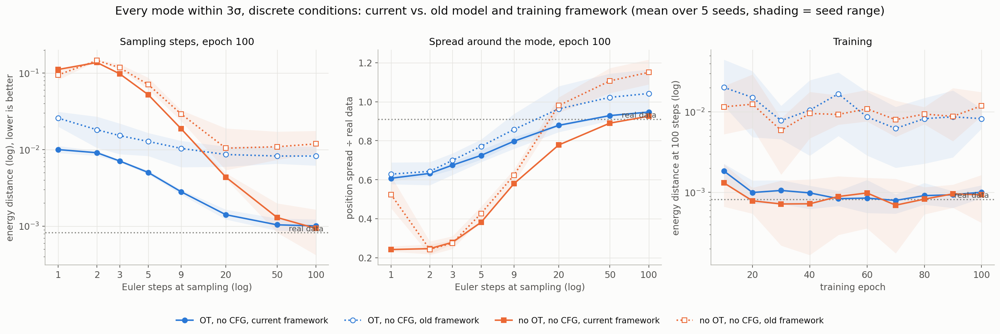

*3σ task, discrete conditions, models trained without CFG. Solid = current framework, dotted = old (Part 1). Left:
energy distance vs. Euler steps. Middle: position spread relative to real data's. Right: energy distance at 100
steps during training. Mean over 5 seeds; shading = seed range.*

- **At 100 steps the samples reach the metric's floor.**
  - With OT: energy distance 0.0010 ± 0.0001, against 0.0082 ± 0.0018 before.
  - Without OT: 0.0009 ± 0.0005, against 0.0119 ± 0.0034.
  - Real data scores 0.0008.
- **With OT, few-step sampling is 2–2.6× better.**
  - 3 steps: 0.0071 vs. 0.015.
  - 1 step: 0.010 vs. 0.026.
  - Without OT, few steps don't improve (3 steps: 0.098 vs. 0.118), because the paths still cross.
- **Part 1's over-dispersion is gone.** Position spread at 100 steps is 0.95× (OT) and 0.93× (no OT) the data's,
  against 1.04× and 1.15× before. Real data scores 0.91×.
- **The seeds agree:** the seed range shrinks about tenfold.
- **Training converges by about epoch 20** (right panel). The old framework's energy distance wandered between
  0.006 and 0.02 and never settled.
- **One regression:** at a single step, samples spread 2.5× too widely in rotation (old: 1.0×). Energy distance
  at one step is still 2.6× better.

The settled practices were adopted together, so which of them produces the gain isn't measured.

### 2. OT and guidance on the current framework (discrete conditions)

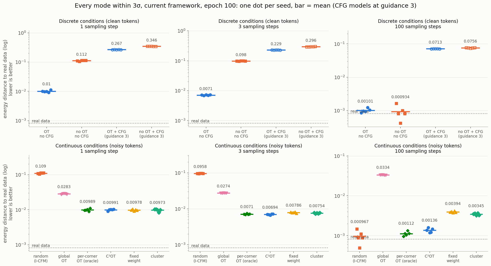

*Energy distance per configuration at 1, 3 and 100 Euler steps. Top: discrete conditions; bottom: continuous
conditions (section 3). One dot per seed; bar = mean. CFG-trained models are sampled at guidance 3. Epoch 100.*

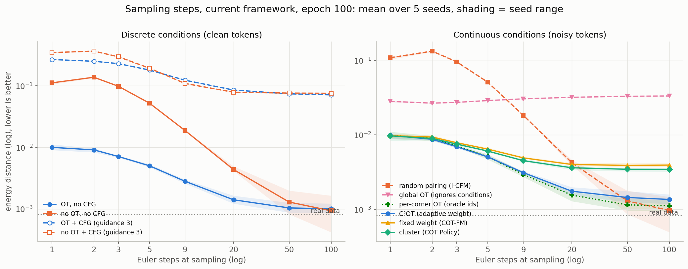

*Energy distance vs. Euler steps. Mean over 5 seeds; shading = seed range.*

- **OT still buys fast sampling, and costs nothing in quality at 100 steps.**
  - At 3 steps: 0.0071 with OT, 0.098 without (14×).
  - At 100 steps both are at the floor: 0.0010 vs. 0.0009, within seed noise.
  - OT runs took 1.43× as long to train (817 s vs. 569 s, 6 runs sharing the GPU).
- **Guidance 3 is still the worst choice.**
  - 0.071–0.076 at 100 steps, 70× the unguided models.
  - Corner accuracy 1.00 against the data's 0.73: guidance pulls the overlapping corners apart.
  - Section 6 tries guidance on part of the path only.
- **Baseline for sections 4–6: OT, no CFG.** The rule was fixed before the results: the conditional no-CFG
  variant with the lowest mean of log₁₀ energy distance at 3 and 100 steps (−2.57, vs. −2.04 without OT).

### 3. Pairings on the current framework (continuous conditions)

The bottom rows of the two figures above.

- **C²OT matches the per-corner oracle.**
  - At 3 steps: 0.0069 vs. the oracle's 0.0071; random pairing gets 0.096.
  - At 100 steps: 0.0014 vs. 0.0011.
- **Random pairing still catches up and is best at 100 steps** (0.0010 ± 0.0004). The best pairings are within
  1.4× of it, close to the floor. With the OT batch equal to the network batch, Part 2's 1.5–2.3× gap at 100 steps
  shrinks.
- **Global OT still fails.** 0.033 at 100 steps, with corner accuracy 0.36 against the data's 0.73.
- **Calibration couldn't tell the settings apart here, and its choice hurt.**
  - Because the modes overlap, every setting on the calibration grid kept the prior skew under the 0.02 bound.
  - So calibration picked the loosest value on the grid: `--cond_scale 0.01` for the fixed weight and cluster,
    `--r_tar 0.3` for C²OT.
  - At that setting the fixed weight and cluster under-separate the corners: corner accuracy 0.62–0.63 against the
    data's 0.73, and 100-step energy distance 3× C²OT's (0.0039 and 0.0035).
  - This is a concrete case of Part 2's caveat that the skew statistic is only a lower bound on the harm.
- **Baseline for sections 4–6: C²OT.** Same rule; global OT and the oracle are excluded.

### 4. Single-axis ablations

*In progress.* Each arm changes one choice of the section 2–3 baseline:
- the training-time density (logit-normal, π0's Beta)
- the flow-time embedding (sinusoids of 1000·t, Gaussian Fourier features)
- the condition pathway (cross-attention, joint attention)

Sections 5 and 6 compare ODE solvers at equal network evaluations, and guidance on part of the path, without
retraining.

## Caveats

### Part 1

- **5 seeds per configuration.** Treat differences inside the seed range (the shading and dot spread) as
  unresolved.
- **Small per-condition samples:** 64 samples per condition, so orientation splits within about ±0.12 of 50/50
  are sampling noise.
- **The steps sweep samples CFG-trained models at guidance 3.** Their few-step results mostly reflect guidance;
  at guidance 1 they behave like the models trained without CFG.
- **The training times are rough:** they were measured with 6 runs sharing one GPU.

### Part 2

- **Seeds:** 5 per pairing, 3 per sensitivity setting. Treat differences inside the seed range as unresolved;
  cluster varied most across seeds on continuous goals.
- **The 1× OT batch result is from one pairing on one task.** That the other pairings behave the same is likely
  (Part 1's per-condition OT at 1× was level at 100 steps) but not measured.
- **The calibration bound (0.02) is a choice**, made at the 4× OT batch and kept for the 1× and 10× runs. The
  skew R² is a lower bound on the harm: on the fork, global OT scores R² ≈ 0, yet its trained model stays biased
  (W₂² 0.022 vs. 0.001 at convergence).
- **Pairing cost:** this repo's OT uses the unsquared twist distance; the papers use squared distances, whose
  optimal assignments are unique where unsquared ones can tie.
- **Toys:** this repo's transformer instead of C²OT's MLP, and W₂² on 4096 samples instead of 10k (floor 0.018
  on moons).
- **The per-corner oracle uses the clean corner ids**, which a real continuous task doesn't have.
- **Recorded commits:** several Part 2 runs record their commit with a "-dirty" suffix. Uncommitted documentation
  and figure-script edits were in the working tree when they started. The training code didn't change:
  `git diff 0ec96f8 HEAD` is empty for `utils/`, `models/`, `configs/` and both trainers.

### Part 3

- **5 seeds, 64 samples per condition.** At 100 steps the best models sit at the metric's floor: real data scores
  0.0008, and single seeds land below it. Differences there are unresolved; more evaluation samples would be
  needed to separate them.
- **The settled practices were adopted together**, so the gain over the old framework isn't attributed to any
  one of them.
- **The old-framework comparison covers discrete conditions only.** The noisy-token 3σ task is new, and has no
  pre-framework runs.
- **The calibration chose the edge of its grid** (section 3), so the fixed weight and cluster ran at a setting the
  calibration didn't really select.
- **Training times** were measured with 6 runs sharing the GPU. The noisy-token runs shared it with 6 more, so
  their times aren't quoted.
- **Recorded commits:** the Part 3 runs record `d727163`, most with a "-dirty" suffix, because the figure script
  was being edited while they trained. The training code didn't change: `git diff d727163` is empty for
  `utils/`, `models/`, `configs/`, both trainers and `pose_ablations.sh`.

## Reproducing

```bash
conda activate FmT
for t in corners_two_orientations corners_3sigma; do
  TASK_CONFIG=configs/pose_tasks/$t.yaml ./pose_ablations.sh          # train 5 seeds × 6 variants, evaluate epoch 100
  TASK_CONFIG=configs/pose_tasks/$t.yaml ./pose_ablations.sh curves   # metrics at every saved epoch
  python pose_gen_inference.py --visualize_task -CP checkpoints/pose_$t/seed_1/ -CE 100 -N 12   # 3-D figures
done
python experiments/summary_figures.py     # the Part 1 figures -> docs/ablations/
python -m unittest discover -s tests -t . # pairing, masking, metric and task-file tests
```

Results land in `experiments/results/pose_<task>/` (gitignored): `epoch_<E>/seed_<N>/` holds the per-seed metrics
and sweeps, and `training_curves/` the per-epoch metrics. Checkpoints are in `checkpoints/pose_<task>/seed_<N>/`.
The two tasks were trained at `5f77177` (two orientations) and `af9cf5d` (3σ); every result row records the commit
it was evaluated at.

Part 2 (continuous conditioning):

```bash
./toy_ablations.sh diagnostics && ./toy_ablations.sh      # toys: pairing statistics, then 5 pairings x 2 toys x 3 seeds
for t in corners_two_orientations_jitter continuous_goals; do
  TASK_CONFIG=configs/pose_tasks/$t.yaml ./pose_ablations.sh diagnostics   # pairing statistics, no training
  TASK_CONFIG=configs/pose_tasks/$t.yaml ./pose_ablations.sh calibrate     # choose the knobs (writes pairing_calibration.env)
  TASK_CONFIG=configs/pose_tasks/$t.yaml ./pose_ablations.sh               # train 5 seeds x every pairing, evaluate epoch 100
done
SENS_PAIRING=c2ot_fixed TASK_CONFIG=configs/pose_tasks/continuous_goals.yaml ./pose_ablations.sh sensitivity
python experiments/summary_figures.py --part continuous   # the Part 2 figures -> docs/ablations/
```

Toy results are in `experiments/results/toy_<toy>/`, the pose results and calibration files in
`experiments/results/pose_<task>/`, and the sensitivity runs under `sensitivity/<setting>/`. The toys were trained at
`ba943ac` to `2567ead` (identical training code), the pose tasks at `0ec96f8`, and evaluated at `0e6ce65`
(sensitivity: `d255f62`).

Part 3 (current framework; Parts 1–2 need tag `pose-continuous-v1`, whose code can load their checkpoints):

```bash
export TASK_CONFIG=configs/pose_tasks/corners_3sigma.yaml
./pose_ablations.sh && ./pose_ablations.sh curves             # OT x CFG, 5 seeds; results in experiments/results/sota/
export TASK_CONFIG=configs/pose_tasks/corners_3sigma_jitter.yaml OT_BATCH_MULT=1
./pose_ablations.sh calibrate && ./pose_ablations.sh && ./pose_ablations.sh curves   # every pairing, 5 seeds
python experiments/summary_figures.py --part sota --only baseline framework overview steps
```
